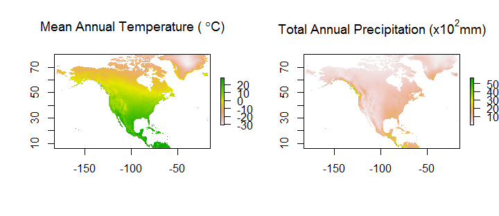
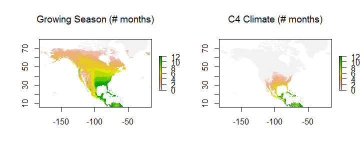
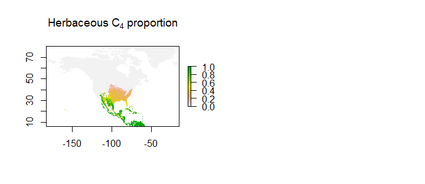
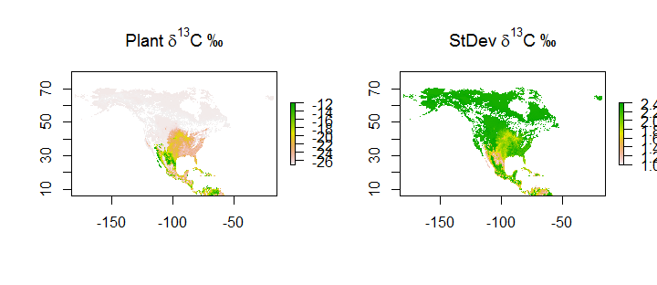

Introduction to grassmapr
================
Daniel M Griffith, Rebecca L Powell, Sydney Firmin, Jen Cotton & Christopher J Still
December 2018

Introduction & Objectives
-------------------------

This vignette serves as an introduction to the grassmapr R package. The workflow that follows also requires learning some basic fuctionality in the raster R package.

Our goal is to predict plant tissue *δ*<sup>13</sup>C variation across a landscape. The primary driver of variation in plant *δ*<sup>13</sup>C is the greater isotopic fractionation in C<sub>3</sub> plants compared to C<sub>4</sub> plants. The crossover temperature model is a physiologically based model that explains the turnover from C<sub>3</sub> to C<sub>4</sub> plants along gradients of temperature (Ehleringer et al., 1997; Collatz et al., 1998; Still et al., 2003).

We will combine the crossover temperature model with data on land cover and climate to produce map of C<sub>3</sub> and C<sub>4</sub> plants in North America. Then, we will apply isotopic endmember values to produce a spatially continuous representation of leaf *δ*<sup>13</sup>C distribution across the land surface These layers are useful for understanding grass biogeography and for studies seeking to identify the movement of animals (e.g., Hobson, 1999; Powell et al., 2012)

Load North America example data
-------------------------------

First, Load the required R libraries:

``` r
library(devtools)
library(raster)
library(grassmapr)
```

Next, load the spatial datasets that we will use in this example. <br>

``` r
data(temp_NA)     # Mean monthly temperature (deg. C)
data(prec_NA)     # Mean monthly precipitation totals (mm)
data(ndvi_NA)     # Mean monthly NDVI ("greenness")
data(woody_NA)    # Vegetation layer: woody cover (%)
data(cropC3_NA)   # Vegetation layer: C3 crop cover (%)
data(cropC4_NA)   # Vegetation layer: C4 crop cover (%)
```

The rainfall and temperature data are monthly climatologies, so we might want to visualize them as annual means. Based on the crossover temperature model, where would you expect to find C<sub>4</sub> grasses? <br>

``` r
par(mfrow = c(1,2))  
annual_temp <- calc(temp_NA, fun = mean)
plot(annual_temp, 
  main = expression(paste("Mean Annual Temperature (",~degree, "C)", sep = ""))) 

annual_prec <- calc(prec_NA, fun = sum)/100      # rescale to plot
plot(annual_prec, 
  main = expression(paste("Total Annual Precipitation (x10"^2, "mm)", sep = "")))
```

 <br> <br> Before we proceed, we should ensure that all data have the same geographic extent and spatial resolution. <br>

``` r
compareRaster(temp_NA,
              prec_NA,
              ndvi_NA,
              woody_NA,
              cropC4_NA,
              cropC3_NA)
```

If any of these layers had a different extent or resolution, we could apply the function raster::resample() to make the layers compatible with each other.

A Workflow to produce a C<sub>3</sub> and C<sub>4</sub> distribution map for North America
------------------------------------------------------------------------------------------

First, we will set a C<sub>4</sub> temperature threshold based on the crossover temperature model. Note that in this example we are using mean monthly temperature as our climatic variable, but we could set a threshold based on other temperature variables, such as maximum monthly temperature.

Second, we will set a minimum growing season temperature threshold, as well as a minimum monthly precipitation threshold. The latter screens for locations that have sufficient moisture to support vegetation growth for a given month - that is, we exclude locations that have insufficient precipitation for plant growth for a given month - for example, deserts and Mediterranean climates. <br>

``` r
# Set a C4 temperature threshold based on the COT model (>= 22 deg. C)
C4_temp <- 22
# Set a growing season temperature threshold (>= 5 deg. C)
GS_temp <- 5
# Set a precipitation threshold (>= 25 mm)
GS_prec <- 25
```

Create two stacks of climate mask layers to represent (i) months that favor C<sub>4</sub> plants and (ii) months that meet the growing season (GS) criteria. <br>

``` r
# Generate monthly C4 climate masks
C4_masks <- mask_climate(temp.stack = temp_NA,
                         temp.threshold = C4_temp,
                         precip.stack = prec_NA,
                         precip.threshold = GS_prec)

# Generate monthly GS climate masks
GS_masks <- mask_climate(temp.stack = temp_NA,
                         temp.threshold = GS_temp,
                         precip.stack = prec_NA,
                         precip.threshold = GS_prec)
```

We can count the monthly masks to generate an annual representation of the total number of C<sub>4</sub> months and total number of growing season months for each location. <br>

``` r
# Count number of months that satisfy each climate criteria
GS_month_total <- count_months(GS_masks)
C4_month_total <- count_months(C4_masks)
  
par(mfrow = c(1,2))
plot(GS_month_total, 
  main = expression("Growing Season (# months)"), zlim = c(0, 12))
plot(C4_month_total, 
  main = expression("C4 Climate (# months)"), zlim = c(0, 12))
```

 <br> <br> With these two monthly climate masks - and, optionally, monthly NDVI layers - we can calculate the proportion of the herbaceous layer that is C<sub>4</sub> (i.e., the C<sub>4</sub> *potential*). Note this is different than predicting *actual* vegetation cover. <br>

``` r
# Calculate C4 proportion based on C4 climate only
C4_ratio <- calc_C4_ratio(C4_masks, GS_masks)

# Optionally: Calculate C4 proportion based on C4 climate AND vegetation productivity
C4_ratio_vi <- calc_C4_ratio(C4_masks, GS_masks, veg.index = ndvi_NA)
  
par(mfrow = c(1,2))
plot(C4_ratio, main = expression(paste("Herbaceous C"[4]~"proportion"))) 
```

 <br> <br> Combine the herbaceous C<sub>4</sub> proportion with other vegetation layers such as woody cover and crop cover. *Note: The user must provide any vegetation layers representaing actual land cover.* <br>

``` r
# Create raster stack of other (non-grassy) vegetation layers
veg_layers <- stack(woody_NA, cropC3_NA, cropC4_NA)
  
# Indicate layers that correspond to C4 vegetation
C4_flag <- c(0, 0, 1)

# Indicate layers that correspond to herbaceous vegetation
herb_flag <- c(0, 1, 1)
  
# Calculate plant functional type layers (C4 grass, C3 grass, woody)
pft_cover <- calc_pft_cover(C4.ratio = C4_ratio, 
                            GS.mask = GS_masks, 
                            veg.layers = veg_layers, 
                            C4.flag = C4_flag, 
                            herb.flag = herb_flag)  

par(mfrow = c(2,2))
plot(pft_cover[[1]], 
  main = expression(paste("C"[4]~"Herbaceous cover (%)", sep = "")))
plot(pft_cover[[2]], 
  main = expression(paste("C"[3]~"Herbaceous cover (%)", sep = "")))
plot(pft_cover[[3]], 
  main = expression("Woody cover (%)"))
```


Turning the vegetation map into an isoscape
-------------------------------------------

We will generate a vegetation stable carbon (*δ*<sup>13</sup>C) isoscape by applying a simple linear mixing model to each grid cell. From the literature, we identify *δ*<sup>13</sup>C endmember values for each plant functional type layer. Isotopic endmembers are weighted by the respective percent vegetation composition of each pixel (in this case, C<sub>4</sub> herbaceous, C<sub>3</sub> herbaceous, C<sub>3</sub> woody).

Note that in this example, we have elected to combine the C<sub>4</sub> and C<sub>3</sub> crop layers with corresponding natural grass layers; however, the functions presented here could be easily adapted for custom plant cover types.

``` r
# d13C endmember vector for PFT layers from the literature
d13C_emb <- c(-12.5, # C4 herb
              -26.7, # C3 herb
              -27.2) # woody

# Apply mixing model to generate d13C isoscape
d13C_iso <- calc_del13C(pft_cover, d13C_emb)

# Standard deviation of d13C endmember means from the literature
d13C_std <- c(1.1, # C4 herb
              2.3, # C3 herb
              2.5) # woody

# Calculate weighted standard deviation of mean d13C values
d13C_iso_std <- calc_del13C(pft_cover, d13C_std)

# Mac Users: substitute "\u2030" for "\211"
par(mfrow = c(1,2))
plot(d13C_iso, main = expression(Plant~{delta}^13*C~"\211"), 
  zlim = c(-27,-12))  
plot(d13C_iso_std, main = expression(StDev~{delta}^13*C~"\211"),
  zlim = c(1.0, 2.4)) 
```

 <br><br>

References
----------

Cerling, T. E., & Harris, J. M. (1999). Carbon isotope fractionation between diet and bioapatite in ungulate mammals and implications for ecological and paleoecological studies. Oecologia, 120, 347 - 363.

Collatz, G. J., Berry, J. A., & Clark, J. S. (1998). Effects of climate and atmospheric CO2 partial pressure on the global distribution of C4 grasses: Present, past, and future. Oecologia, 114, 441 - 454.

Ehleringer, J. R., Cerling, T. E., & Helliker, B. R. (1997). C 4 photosynthesis, atmospheric CO 2 , and climate. Oecologia, 112, 285 - 299.

Hobson, K. A. (1999). Tracing origins and migration of wildlife using stable isotopes: A review. Oecologia, 120, 314 - 326.

Powell, R. L., Yoo, E.-H., & Still, C. J. (2012). Vegetation and soil carbon 13 isoscapes for South America: Integrating remote sensing and ecosystem isotope measurements. Ecosphere, 3, 1 - 25.

Still, C. J., Berry, J. A., Collatz, G. J., & DeFries, R. S. (2003). Global distribution of C 3 and C 4 vegetation: Carbon cycle implications. Global Biogeochemical Cycles, 17, 1006.

<br><br><br><br><br><br><br><br><br><br><br><br><br><br><br><br><br><br><br><br><br><br><br><br><br><br><br><br><br><br>
